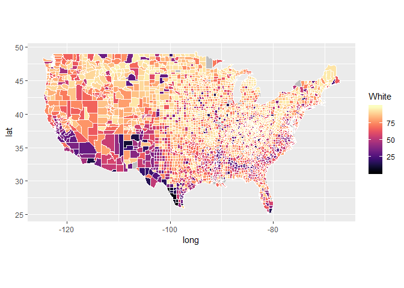

SUSA - A PrimeR
================
Nicholas Lai
September 6, 2018

One of the most common uses of R is to generate beautiful data visualizations. In fact, many professional data journalism outfits such as FiveThirtyEight and The New York Times use R to create their graphics.

Today, we will be creating a graph of the United States by county. This may sound like a daunting first task, but because of the wonderful packages that the R community has produced, it will become clear that doing so is quite managable.

Getting the Map
===============

The ggplot2 R package is one of the most powerful graphical tools available in R. One of the functions of the package allows us to extract map data for the US and for counties of the US.

``` r
usa <- map_data("usa")
counties <- map_data("county")
```

We can read in census data using functions in R, and using the head function, we can inspect the data's structure.

``` r
county_data <- read.csv("acs2015_county_data.csv")
head(county_data)
```

    ##   CensusId   State  County TotalPop   Men Women Hispanic White Black
    ## 1     1001 Alabama Autauga    55221 26745 28476      2.6  75.8  18.5
    ## 2     1003 Alabama Baldwin   195121 95314 99807      4.5  83.1   9.5
    ## 3     1005 Alabama Barbour    26932 14497 12435      4.6  46.2  46.7
    ## 4     1007 Alabama    Bibb    22604 12073 10531      2.2  74.5  21.4
    ## 5     1009 Alabama  Blount    57710 28512 29198      8.6  87.9   1.5
    ## 6     1011 Alabama Bullock    10678  5660  5018      4.4  22.2  70.7
    ##   Native Asian Pacific Citizen Income IncomeErr IncomePerCap
    ## 1    0.4   1.0       0   40725  51281      2391        24974
    ## 2    0.6   0.7       0  147695  50254      1263        27317
    ## 3    0.2   0.4       0   20714  32964      2973        16824
    ## 4    0.4   0.1       0   17495  38678      3995        18431
    ## 5    0.3   0.1       0   42345  45813      3141        20532
    ## 6    1.2   0.2       0    8057  31938      5884        17580
    ##   IncomePerCapErr Poverty ChildPoverty Professional Service Office
    ## 1            1080    12.9         18.6         33.2    17.0   24.2
    ## 2             711    13.4         19.2         33.1    17.7   27.1
    ## 3             798    26.7         45.3         26.8    16.1   23.1
    ## 4            1618    16.8         27.9         21.5    17.9   17.8
    ## 5             708    16.7         27.2         28.5    14.1   23.9
    ## 6            2055    24.6         38.4         18.8    15.0   19.7
    ##   Construction Production Drive Carpool Transit Walk OtherTransp
    ## 1          8.6       17.1  87.5     8.8     0.1  0.5         1.3
    ## 2         10.8       11.2  84.7     8.8     0.1  1.0         1.4
    ## 3         10.8       23.1  83.8    10.9     0.4  1.8         1.5
    ## 4         19.0       23.7  83.2    13.5     0.5  0.6         1.5
    ## 5         13.5       19.9  84.9    11.2     0.4  0.9         0.4
    ## 6         20.1       26.4  74.9    14.9     0.7  5.0         1.7
    ##   WorkAtHome MeanCommute Employed PrivateWork PublicWork SelfEmployed
    ## 1        1.8        26.5    23986        73.6       20.9          5.5
    ## 2        3.9        26.4    85953        81.5       12.3          5.8
    ## 3        1.6        24.1     8597        71.8       20.8          7.3
    ## 4        0.7        28.8     8294        76.8       16.1          6.7
    ## 5        2.3        34.9    22189        82.0       13.5          4.2
    ## 6        2.8        27.5     3865        79.5       15.1          5.4
    ##   FamilyWork Unemployment
    ## 1        0.0          7.6
    ## 2        0.4          7.5
    ## 3        0.1         17.6
    ## 4        0.4          8.3
    ## 5        0.4          7.7
    ## 6        0.0         18.0

In order to plot the data on a map, we need to merge the data with the map data.

``` r
county_data$County <- sapply(county_data$County, tolower)
head(counties)
```

    ##        long      lat group order  region subregion
    ## 1 -86.50517 32.34920     1     1 alabama   autauga
    ## 2 -86.53382 32.35493     1     2 alabama   autauga
    ## 3 -86.54527 32.36639     1     3 alabama   autauga
    ## 4 -86.55673 32.37785     1     4 alabama   autauga
    ## 5 -86.57966 32.38357     1     5 alabama   autauga
    ## 6 -86.59111 32.37785     1     6 alabama   autauga

``` r
colnames(county_data)[colnames(county_data)=="County"] <- "subregion"

usa_county_data <- inner_join(counties, county_data, by = "subregion")

head(usa_county_data)
```

    ##        long      lat group order  region subregion CensusId   State
    ## 1 -86.50517 32.34920     1     1 alabama   autauga     1001 Alabama
    ## 2 -86.53382 32.35493     1     2 alabama   autauga     1001 Alabama
    ## 3 -86.54527 32.36639     1     3 alabama   autauga     1001 Alabama
    ## 4 -86.55673 32.37785     1     4 alabama   autauga     1001 Alabama
    ## 5 -86.57966 32.38357     1     5 alabama   autauga     1001 Alabama
    ## 6 -86.59111 32.37785     1     6 alabama   autauga     1001 Alabama
    ##   TotalPop   Men Women Hispanic White Black Native Asian Pacific Citizen
    ## 1    55221 26745 28476      2.6  75.8  18.5    0.4     1       0   40725
    ## 2    55221 26745 28476      2.6  75.8  18.5    0.4     1       0   40725
    ## 3    55221 26745 28476      2.6  75.8  18.5    0.4     1       0   40725
    ## 4    55221 26745 28476      2.6  75.8  18.5    0.4     1       0   40725
    ## 5    55221 26745 28476      2.6  75.8  18.5    0.4     1       0   40725
    ## 6    55221 26745 28476      2.6  75.8  18.5    0.4     1       0   40725
    ##   Income IncomeErr IncomePerCap IncomePerCapErr Poverty ChildPoverty
    ## 1  51281      2391        24974            1080    12.9         18.6
    ## 2  51281      2391        24974            1080    12.9         18.6
    ## 3  51281      2391        24974            1080    12.9         18.6
    ## 4  51281      2391        24974            1080    12.9         18.6
    ## 5  51281      2391        24974            1080    12.9         18.6
    ## 6  51281      2391        24974            1080    12.9         18.6
    ##   Professional Service Office Construction Production Drive Carpool
    ## 1         33.2      17   24.2          8.6       17.1  87.5     8.8
    ## 2         33.2      17   24.2          8.6       17.1  87.5     8.8
    ## 3         33.2      17   24.2          8.6       17.1  87.5     8.8
    ## 4         33.2      17   24.2          8.6       17.1  87.5     8.8
    ## 5         33.2      17   24.2          8.6       17.1  87.5     8.8
    ## 6         33.2      17   24.2          8.6       17.1  87.5     8.8
    ##   Transit Walk OtherTransp WorkAtHome MeanCommute Employed PrivateWork
    ## 1     0.1  0.5         1.3        1.8        26.5    23986        73.6
    ## 2     0.1  0.5         1.3        1.8        26.5    23986        73.6
    ## 3     0.1  0.5         1.3        1.8        26.5    23986        73.6
    ## 4     0.1  0.5         1.3        1.8        26.5    23986        73.6
    ## 5     0.1  0.5         1.3        1.8        26.5    23986        73.6
    ## 6     0.1  0.5         1.3        1.8        26.5    23986        73.6
    ##   PublicWork SelfEmployed FamilyWork Unemployment
    ## 1       20.9          5.5          0          7.6
    ## 2       20.9          5.5          0          7.6
    ## 3       20.9          5.5          0          7.6
    ## 4       20.9          5.5          0          7.6
    ## 5       20.9          5.5          0          7.6
    ## 6       20.9          5.5          0          7.6

After we have the merged data, we are ready to plot!

``` r
ggplot(data = usa, aes(x=long, y = lat, group = group)) + geom_polygon(fill = 'gray')+
  coord_fixed(1.3) + geom_polygon(data = usa_county_data, aes(fill = White), color = "white") + scale_fill_viridis(option="magma")
```



Your Turn
=========

Say you are interested in the percentage of people in a given county that are citizens. To get this data, divide the column of 'Citizen' with the column of 'TotalPop'.

``` r
usa_county_data$prop_citizen <- usa_county_data$Citizen/usa_county_data$TotalPop

head(usa_county_data) 
```

    ##        long      lat group order  region subregion CensusId   State
    ## 1 -86.50517 32.34920     1     1 alabama   autauga     1001 Alabama
    ## 2 -86.53382 32.35493     1     2 alabama   autauga     1001 Alabama
    ## 3 -86.54527 32.36639     1     3 alabama   autauga     1001 Alabama
    ## 4 -86.55673 32.37785     1     4 alabama   autauga     1001 Alabama
    ## 5 -86.57966 32.38357     1     5 alabama   autauga     1001 Alabama
    ## 6 -86.59111 32.37785     1     6 alabama   autauga     1001 Alabama
    ##   TotalPop   Men Women Hispanic White Black Native Asian Pacific Citizen
    ## 1    55221 26745 28476      2.6  75.8  18.5    0.4     1       0   40725
    ## 2    55221 26745 28476      2.6  75.8  18.5    0.4     1       0   40725
    ## 3    55221 26745 28476      2.6  75.8  18.5    0.4     1       0   40725
    ## 4    55221 26745 28476      2.6  75.8  18.5    0.4     1       0   40725
    ## 5    55221 26745 28476      2.6  75.8  18.5    0.4     1       0   40725
    ## 6    55221 26745 28476      2.6  75.8  18.5    0.4     1       0   40725
    ##   Income IncomeErr IncomePerCap IncomePerCapErr Poverty ChildPoverty
    ## 1  51281      2391        24974            1080    12.9         18.6
    ## 2  51281      2391        24974            1080    12.9         18.6
    ## 3  51281      2391        24974            1080    12.9         18.6
    ## 4  51281      2391        24974            1080    12.9         18.6
    ## 5  51281      2391        24974            1080    12.9         18.6
    ## 6  51281      2391        24974            1080    12.9         18.6
    ##   Professional Service Office Construction Production Drive Carpool
    ## 1         33.2      17   24.2          8.6       17.1  87.5     8.8
    ## 2         33.2      17   24.2          8.6       17.1  87.5     8.8
    ## 3         33.2      17   24.2          8.6       17.1  87.5     8.8
    ## 4         33.2      17   24.2          8.6       17.1  87.5     8.8
    ## 5         33.2      17   24.2          8.6       17.1  87.5     8.8
    ## 6         33.2      17   24.2          8.6       17.1  87.5     8.8
    ##   Transit Walk OtherTransp WorkAtHome MeanCommute Employed PrivateWork
    ## 1     0.1  0.5         1.3        1.8        26.5    23986        73.6
    ## 2     0.1  0.5         1.3        1.8        26.5    23986        73.6
    ## 3     0.1  0.5         1.3        1.8        26.5    23986        73.6
    ## 4     0.1  0.5         1.3        1.8        26.5    23986        73.6
    ## 5     0.1  0.5         1.3        1.8        26.5    23986        73.6
    ## 6     0.1  0.5         1.3        1.8        26.5    23986        73.6
    ##   PublicWork SelfEmployed FamilyWork Unemployment prop_citizen
    ## 1       20.9          5.5          0          7.6    0.7374912
    ## 2       20.9          5.5          0          7.6    0.7374912
    ## 3       20.9          5.5          0          7.6    0.7374912
    ## 4       20.9          5.5          0          7.6    0.7374912
    ## 5       20.9          5.5          0          7.6    0.7374912
    ## 6       20.9          5.5          0          7.6    0.7374912

Say you are interested in total number of white people in a county. How would you transform your data to get those values?

``` r
#Your code here
```

Now, plot one of the two above new variables to the US county map like above.

``` r
#Your code here
```

Look back at the usa\_county\_data object. It has a very redundant column as a quirk of our 'inner.join'. Which columns are redundant?

We can remove it:

``` r
#usa_county_data$col_name <- NULL
```

Challenge Question:

In a similar way to which we can visualize the county\_data on the county level, we can visualize it on a state level.

Aggregate a variable of the data by state and join that to a map\_data object, and plot that variable on the state level using a modification of the above method.

``` r
#Your code here
```
